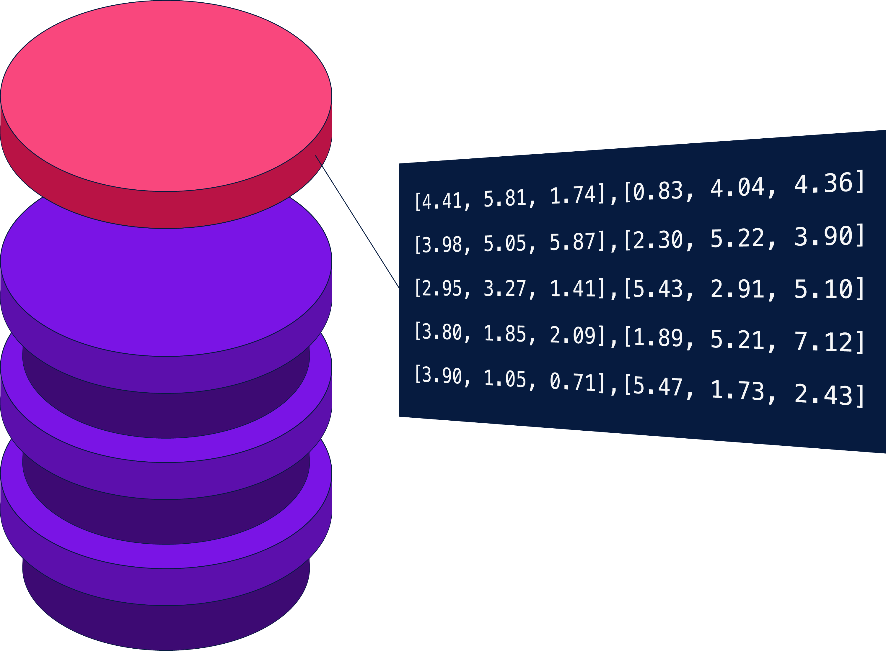

<h1 align="center">
	
	<br>
</h1>

<div align="center">
	<a href="https://github.com/featureform/embeddings/actions"></a>
    <a href="https://pypi.org/project/embeddinghub/" target="_blank"></a>
    <a href="https://featureform-community.slack.com/ssb/redirect" target="_blank"></a>
    <br>
    <a href="https://www.python.org/downloads/" target="_blank"></a>
    <a href="https://pypi.org/project/embeddinghub/" target="_blank"></a>
    <a href="https://www.featureform.com/"></a>  
    <a href="https://twitter.com/featureformML" target="_blank"></a>


	
</div>

<div align="center">
    <h3 align="center">
        <a href="https://www.featureform.com/">Website</a>
        <span> | </span>
        <a href="https://docs.featureform.com/v/main/">Docs</a>
        <span> | </span>
        <!-- <a href="https://apidocs.featureform.com/">API Docs</a>
        <span> | </span> -->
        <a href="https://featureform-community.slack.com/ssb/redirect">Community forum</a>
    </h3>
</div>


# What is Embeddinghub?

[Embeddinghub](https://docs.featureform.com/) is a database built for machine learning embeddings. It is built with four goals in mind.

* Store embeddings durably and with high availability
* Allow for approximate nearest neighbor operations
* Enable other operations like partitioning, sub-indices, and averaging
* Manage versioning, access control, and rollbacks painlessly



Prior to Embeddinghub, many organizations would use three different tools to achieve these three goals. With Embeddinghub, you get a database that’s built from the ground up to achieve this functionality.
 
## Features
* **Supported Operations**: Run approximate nearest neighbor lookups, average multiple embeddings, partition tables (spaces), cache locally while training, and more.
* **Storage**: Store and index billions vectors embeddings from our storage layer.
* **Versioning**: Create, manage, and rollback different versions of your embeddings.
* **Access Control**: Encode different business logic and user management directly into Embeddinghub.
* **Monitoring**: Keep track of how embeddings are being used, latency, throughput, and feature drift over time.

<br />

# Getting Started

## Step 1: Install Embeddinghub client

Install the Python SDK via pip

```
pip install embeddinghub
```

## Step 2: Deploy Docker container ( _optional_ )
The Embeddinghub client can be used without a server. This is useful when using embeddings in a research environment where a database server is not necessary. If that’s the case for you, skip ahead to the next step.

Otherwise, we can use this docker command to run Embeddinghub locally and to map the container's main port to our host's port.

```
docker run featureformcom/embeddinghub -p 74622:74622
```

## Step 3: Initialize Python Client

If you deployed a docker container, you can initialize the python client.

```py
import embeddinghub as eh

hub = eh.connect(eh.Config())
```
Otherwise, you can use a LocalConfig to store and index embeddings locally.

```py
hub = eh.connect(eh.LocalConfig())
```

## Step 4: Create a Space

Embeddings are written and retrieved from Spaces. When creating a Space we must also specify a version, otherwise a default version is used.

```py
space = hub.create_space("quickstart", dims=3)
```

## Step 5: Upload Embeddings
We will create a dictionary of three embeddings and upload them to our new quickstart space.

```py
embeddings = {
    "apple": [1, 0, 0],
    "orange": [1, 1, 0],
    "potato": [0, 1, 0],
    "chicken": [-1, -1, 0],
}
space.multiset(embeddings)
```

## Step 6: Get nearest neighbors

Now we can compare apples to oranges and get the nearest neighbors.

```py
neighbors = quickstart.nearest_neighbors(key="apple", num=2)
print(neighbors)
```

* [Read through our guide to further explore Embeddinghub’s functionality.](overview.md)
* [Explore our docs](https://docs.featureform.com/)

<br />

# Contributing

* To contribute to Embeddinghub, please check out [Contribution docs](https://github.com/featureform/embeddings/blob/main/CONTRIBUTING.md).
* Welcome to our awesome community, please join our [Slack community](https://featureform-community.slack.com/ssb/redirect).

<br />


# Report Issues

Please help us by [reporting any issues](https://github.com/featureform/embeddings/issues/new/choose) you may have while using Embeddinghub.

<br />

# License

* [Mozilla Public License Version 2.0](https://github.com/featureform/embeddings/blob/main/LICENSE)