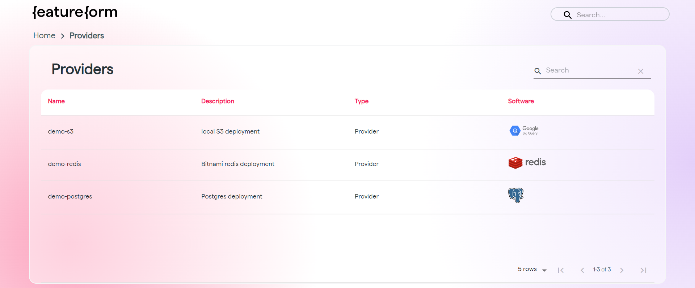

# Exploring the Feature Registry

Once we have everything registered (e.g. features, training sets, providers), we can see information about them on the Feature Registry.

## Homepage

.png>)

The homepage contains links to:

* ****[**Sources**](overview.md#source)**:** Both primary sources and transformed sources, from streams to files to tables.
* ****[**Features**](overview.md#feature)**:** Inputs to models, transformed from raw data. To be [served for inference](serving-for-inference-and-training.md#serving-for-inference).
  * e.g. Raw data about all user transactions can be transformed into features such as _**avg\_transaction\_amt**_ and _**user\_account\_age**_.
* ****[**Entities**](overview.md#entity)**:** Higher-level groupings of features, dependent on where a set of features originates from.&#x20;
  * e.g. user\_account\_age and avg\_transaction\_amt are both features under the _**user entity**_.
* ****[**Labels**](overview.md#label)**:** Features that indicate the "correct answer" of a model prediction, or what the model aims to predict.
  * e.g.  The **is\_fraud label** is true if the transaction is fraudulent, and false if the transaction is not fraudulent.
* ****[**Training Sets**](overview.md#training-set)**:** Sets of features matched with the respective labels. To be [served for training](serving-for-inference-and-training.md#serving-for-training).&#x20;
  * e.g. The _**is\_fraud training set**_ contains a set of features __ (amt\_spent, avg\_transaction\_amt, number\_of\_fraud, etc.) and labels.
* **Models:** Programs that can make predictions on a previously unseen dataset, after being trained with training sets.&#x20;
  * e.g. The **user\_fraud\_random\_forest model** is a classifier, predicting whether a user committed fraud.
* ****[**Providers**](overview.md#provider)**:** Data infrastructure used for storage or computation.
* **Users:** Individual data scientists who create, share, or reuse features and models.

## Resource Pages: Features, Sources, Labels, Training Sets

Resources pages generally have the same format. They display a list of that resource type, along with descriptions.&#x20;

.png>)

The feature page has additional columns, namely "type" and "default variant".

.png>)

Click on the arrow next to a source name to see a list of variants of that resource.

.png>)

Next, click on a variant (or the resource name for the default variant) to pull up more details, including the description, owner, provider, data type, status, source, entity, and columns. Some fields link to more information. Change the variant by using the small dropdown menu on the top-right.

.png>)

Metrics, namely throughput, latency, and errors for that variant are displayed for features and training sets.

.png>)

## Entities

The entities page is similar to other resource types, except that there are 3 tabs ("Features", "Labels", "Training Sets"). The features, labels, and training sets corresponding to that entity are shown under these tabs, with the ability to select variants and see detailed views.

.png>)

## Providers

The providers page shows all providers, with the corresponding name, description, type, and software.

Click on the providers to pull up the sources, features, labels, and training sets originating from that provider.

.png>)

## Models

The models page shows all model names, with the corresponding description. Model names are provided by the user at serving time. Featureform tracks which features and training sets are associated with which model names. However, **models are not stored.**

.png>)

## Users

The users page show all users' names. Click on a user to view features, labels, training sets, and sources associated with that user.

.png>)

.png>)
