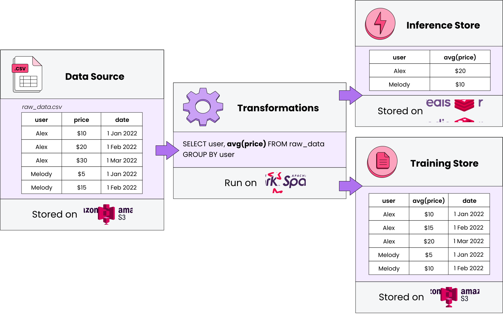

# What is Featureform

Featureform is a **virtual feature store**. It enables data scientists to **define**, **manage**, and **serve** their ML model's features. Featureform sits **atop your existing infrastructure** and orchestrates it to work like a [traditional feature store](https://www.featureform.com/post/feature-stores-explained-the-three-common-architectures).

By using Featureform, a data science team can solve the organizational problems:

* **Enhance Collaboration** Featureform ensures that transformations, features, labels, and training sets are defined in a standardized form, so they can easily be shared, re-used, and understood across the team.
* **Organize Experimentation** The days of untitled\_128.ipynb are over. Transformations, features, and training sets can be pushed from notebooks to a centralized feature repository with metadata like name, variant, lineage, and owner.
* **Facilitate Deployment** Once a feature is ready to be deployed, Featureform will orchestrate your data infrastructure to make it ready in production. Using the Featureform API, you won't have to worry about the idiosyncrasies of your heterogeneous infrastructure (beyond their transformation language).
* **Increase Reliability** Featureform enforces that all features, labels, and training sets are immutable. This allows them to safely be re-used among data scientists without worrying about logic changing. Furthermore, Featureform's orchestrator will handle retry logic and attempt to resolve other common distributed system problems automatically. Finally, Featureform will monitor and notify you of infrastructure problems and data drift.
* **Preserve Compliance** With built-in role-based access control, audit logs, and dynamic serving rules, your compliance logic can be enforced directly by Featureform.

## Why is Featureform unique?

**Use your existing data infrastructure.** Featureform does not replace your existing infrastructure. Rather, Featureform transforms your existing infrastructure into a feature store. In being infrastructure-agnostic, teams can pick the right data infrastructure to solve their processing problems, while Featureform provides a feature store abstraction above it. Featureform orchestrates and manages transformations rather than actually computing them. The computations are offloaded to the organization's existing data infrastructure. In this way, Featureform is more akin to a framework and workflow, than an additional piece of data infrastructure.

**Designed for both single data scientists and large enterprise teams** Whether you're a single data scientist or a part of a large enterprise organization, Featureform allows you to document and push your transformations, features, and training sets definitions to a centralized repository. It works everywhere from a laptop to a large heterogeneous cloud deployment.

* _A single data scientist working locally:_ The days of untitled\_128.ipynb, df\_final\_final\_7, and hundreds of undocumented versions of datasets. A data scientist working in a notebook can push transformation, feature, and training set definitions to a centralized, local repository.
* _A single data scientist with a production deployment:_ Register your PySpark transformations and let Featureform orchestrate your data infrastructure from Spark to Redis, and monitor both the infrastructure and the data.
* _A data science team:_ Share, re-use, and learn from each other's transformations, features, and training sets. Featureform standardizes how machine learning resources are defined and provides an interface for search and discovery. It also maintains a history of changes, allows for different variants of features, and enforces immutability to resolve the most common cases of failure when sharing resources.
* _A data science organization:_ An enterprise will have a variety of different rules around access control of their data and features. The rules may be based on the data scientist’s role, the model’s category, or dynamically based on a user’s input data (i.e. they are in Europe and subject to GDPR). All of these rules can be specified, and Featureform will enforce them. Data scientists can be sure to comply with the organization’s governance rules without modifying their workflow.

**Native embeddings support** Featureform was built from the ground up with embeddings in mind. It supports vector databases as both inference and training stores. Transformer models can be used as transformations, so that embedding tables can be versioned and reliably regenerated. We even created and open-sourced a popular vector database, [Emeddinghub](https://github.com/featureform/featureform/tree/main/embeddinghub).

**Open-source** [Featureform](https://github.com/featureform/featureform) is free to use under the MPL 2.0 license.

## The Featureform Abstraction

In reality, the feature’s definition is split across different pieces of infrastructure: the data source, the transformations, the inference store, the training store, and all their underlying data infrastructure. However, a data scientist will think of a feature in its logical form, something like: “a user’s average purchase price”. Featureform allows data scientists to define features in their logical form through transformation, providers, label, and training set resources. Featureform will then orchestrate the actual underlying components to achieve the data scientists' desired state.
