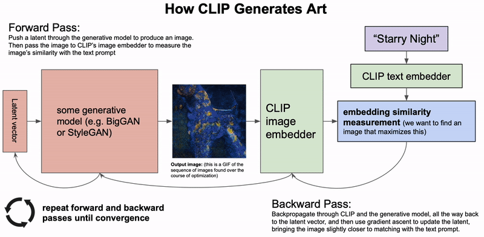
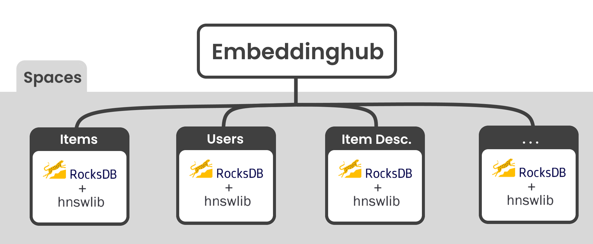

# Overview

## What is Embeddinghub?

Embeddinghub is a database built for machine learning embeddings. It is built with four goals in mind.

* Store embeddings durably and with high availability
* Allow for approximate nearest neighbor operations
* Enable other operations like partitioning, sub-indices, and averaging
* Manage versioning, access control, and rollbacks painlessly

Prior to Embeddinghub, many organizations would use four different tools to achieve these four goals. With Embeddinghub, you get a database that’s built from the ground up to achieve this functionality.

## Concepts

### Embeddings

Embeddings are dense numerical representations of real-world objects and relationships, expressed as a vector. The vector space quantifies the semantic similarity between categories. Embedding vectors that are close to each other are considered similar. Sometimes, they are used directly for “Similar items to this” section in an e-commerce store. Other times, embeddings are passed to other models. In those cases, the model can share learnings across similar items rather than treating them as two completely unique categories, as is the case with one-hot encodings. For this reason, embeddings can be used to accurately represent sparse data like clickstreams, text, and e-commerce purchases as features to downstream models.

### Approximate Nearest Neighbor

Nearest neighbor \(NN\) is often the most useful embedding operation. It finds things that are similar to the current embedding. In recommender systems, we can create a user embedding and find items that are most relevant to them. In a search engine, we can find a document that’s most similar to a search query. Nearest neighbor is a computationally expensive operation however. Performed naively, it is O\(N\*K\), where N is the number of items and K is the size of each embedding. However, in most cases when we need nearest neighbors, an approximation would suffice. If we recommend five items to a user, and one is technically the sixth closest item, the user probably won’t care. Approximate nearest neighbor \(ANN\) algorithms typically drop the complexity of a lookup to O\(log\(n\)\). Embeddinghub uses the HNSW algorithm by default.

## Common Use Cases

### Natural Language Processing

Users expect search bars to be smarter than a regex. Whether it’s a customer support page, a blog, or Google, a search bar should understand the intent and context of a query, not just look at words. Search engines used to be built around TF-IDF, which also creates an embedding from text. This kind of semantic search worked by finding a document embedding that’s closest to the query embedding using nearest neighbor.

Today, semantic search utilizes more sophisticated embeddings like BERT and may use them in downstream models. In fact, even [Google uses BERT on a large percentage of their queries.](https://searchengineland.com/google-bert-used-on-almost-every-english-query-342193/)

### Recommender Systems

A recommender system predicts the preferences and ratings of users for a variety of entities/products. The two most common approaches are collaborative filtering and content-based. Collaborative filtering uses actions to train and form recommendations. Modern collaborative filtering systems almost all use embeddings. As an example, we can use the SVD method to build a recommender system. In that system, multiplying a user embedding by an item embedding generates a rating prediction. This provides a clear relationship between users and products. Similar items beget similar ratings from similar users. This attribute can also be used in downstream models. For example, Youtube’s recommender uses embeddings as inputs to a neural network that predicts watch time.

### Computer Vision

In computer vision, embeddings are often used as a way to translate between different contexts. For example, if training a self-driving car, we can transform the image from the car into an embedding and then decide what to do based on that embedded context. By doing so, we can perform transfer learning. We can take a generated image from a game like Grand Theft Auto, turn it into an embedding in the same vector space, and train the driving model without having to feed it tons of expensive, real-world images. Tesla is doing this in practice today.

Another interesting example is [the AI Art Machine](https://colab.research.google.com/drive/1n_xrgKDlGQcCF6O-eL3NOd_x4NSqAUjK#scrollTo=TnMw4FrN6JeB). It will generate an image based on user input text. For example, if we type in Nostaligia, we get the following image.

It works by transforming the user’s text and an image into an embedding in the same latent space. It's composed of four transformers: Image -&gt; Embedding, Text -&gt; Embedding, Embedding -&gt; Text, Image -&gt; Text. With all these, transformations we can translate text to image and visa-versa using a embedding as an intermediate representation.

## Architecture

The alpha version of the Embeddinghub can only be deployed in a single node configuration. It uses RocksDB to durably store embeddings and metadata, and uses HNSWLib to build approximate nearest neighbor indices. The python client also has the ability to use HNSWLib to build local embeddings but does not currently handle durable storage. The server communicates via gRPC, the proto service file can be found [here](https://github.com/featureform/embeddings/blob/main/embeddingstore/embedding_store.proto). All of the metadata is also stored in serialized protobuf form as defined [here](https://github.com/featureform/embeddings/blob/main/embeddingstore/embedding_store_meta.proto).

 

 
